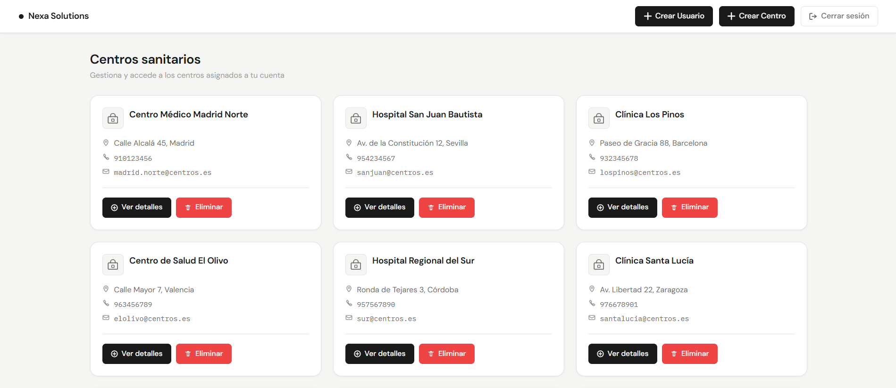
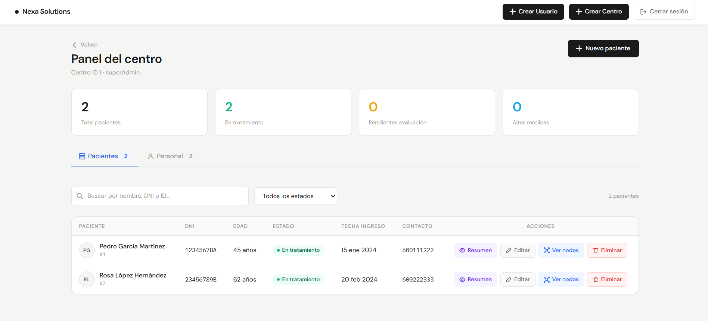
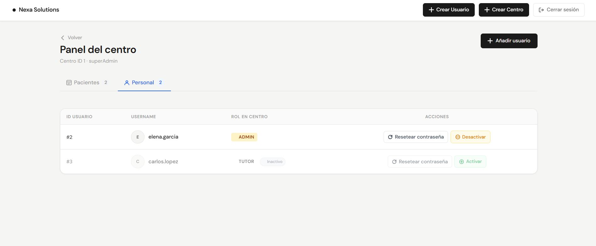
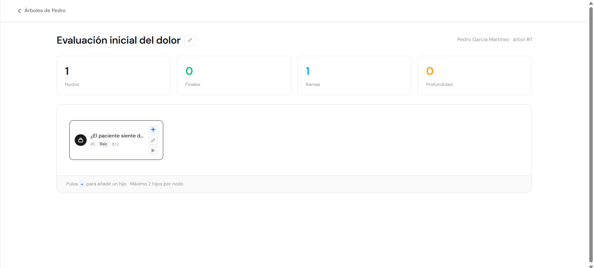

# Frontend — Guía de usuario

Aplicación web desarrollada con **React 19**, **TypeScript** y **Vite**. Consume la API REST del backend Flask.

---

## Inicio de sesión

Al abrir la aplicación se muestra el formulario de inicio de sesión.

- Introduce tu **nombre de usuario** y **contraseña** y pulsa *Iniciar sesión*.
- Si es la **primera vez** que accedes (o tu contraseña fue reseteada por un administrador), se te redirigirá automáticamente a una pantalla para establecer una nueva contraseña antes de continuar.
- Una vez autenticado, si no has aceptado los términos y condiciones, aparecerá un modal que deberás aceptar para poder continuar. Si los rechazas, la sesión se cerrará.
- La sesión se mantiene activa durante 8 horas. Al cerrar sesión o que expire el token, serás redirigido al login.

---

## Panel principal

Tras iniciar sesión accederás al **panel principal**, que muestra la lista de centros sanitarios disponibles para tu cuenta.

- Cada centro se presenta como una tarjeta con su nombre, dirección, teléfono y email.
- Haz clic en una tarjeta para acceder a la gestión de ese centro.
- Los usuarios con rol `superAdmin` ven todos los centros existentes.
- Los usuarios con rol `admin` o `tutor` solo ven los centros a los que están asignados.
- Un `superAdmin` puede crear un nuevo centro desde el panel principal pulsando el botón **Añadir centro** y rellenando el formulario con nombre, dirección, teléfono y email.

---

## Gestión de centros

Al entrar en un centro se abre la pantalla de administración con dos pestañas:

### Pestaña Pacientes

- Muestra una tabla con todos los pacientes del centro con sus datos: nombre, apellidos, DNI, edad, estado y fecha de ingreso.
- **Buscar**: filtra pacientes por nombre o apellidos usando el buscador superior.
- **Filtrar por estado**: desplegable para mostrar solo pacientes en un estado concreto (`En tratamiento`, `Alta médica`, `Pendiente evaluación`, `Baja temporal`).
- **Añadir paciente**: abre un formulario modal para registrar un nuevo paciente.
- **Editar paciente**: botón en cada fila para modificar los datos del paciente.
- **Ver resumen**: abre un modal con el historial médico y toda la información del paciente.
- **Ver árboles**: accede al módulo de actividades terapéuticas del paciente.
- **Eliminar paciente**: disponible para `admin` y `superAdmin`. Requiere confirmación.
- La barra de estadísticas superior muestra el total de pacientes y su distribución por estado.

### Pestaña Personal

- Muestra la tabla de trabajadores asignados al centro con su nombre de usuario, rol y estado (activo/inactivo).
- **Añadir usuario**: permite asignar un usuario existente al centro con un rol (`admin` o `tutor`). Solo disponible para `admin` y `superAdmin`.
- **Activar/Desactivar**: cambia el estado de un trabajador en el centro (toggle). Solo `admin` y `superAdmin`.
- **Resetear contraseña**: restablece la contraseña de un trabajador a su nombre de usuario. El usuario deberá cambiarla en su próximo inicio de sesión.
- **Eliminar del centro**: desvincula a un trabajador del centro.

> Los usuarios con rol `tutor` solo ven el personal activo y no tienen acceso a las acciones de gestión.

---

## Gestión de pacientes

La gestión de pacientes se realiza desde la pestaña **Pacientes** dentro de cada centro.

### Crear paciente
Pulsa **+ Añadir paciente** y completa el formulario:

| Campo | Obligatorio |
|-------|-------------|
| Nombre | Sí |
| Apellidos | Sí |
| DNI | Sí |
| Edad | Sí |
| Contacto | No |
| Historial médico | No |
| Estado | No (por defecto: *En tratamiento*) |
| Fecha de ingreso | No |

### Editar paciente
Pulsa el icono de edición en la fila del paciente para abrir el formulario de edición con los datos actuales precargados.

### Resumen de paciente
Pulsa el icono de información para ver un modal con todos los datos del paciente, incluido el historial médico completo.

### Eliminar paciente
Pulsa el icono de eliminar. Aparecerá un modal de confirmación antes de borrar definitivamente el paciente y todos sus datos asociados.

---

## Actividades terapéuticas (Nodos)

Desde la tabla de pacientes, pulsa el icono de **árbol** para acceder al módulo de actividades terapéuticas del paciente. Este módulo permite construir y ejecutar **árboles de decisión** personalizados.

### Lista de árboles

- Se muestran todos los árboles de decisión creados para ese paciente.
- Pulsa **+ Nuevo árbol** para crear uno nuevo. Se genera automáticamente con un nodo raíz de inicio.
- Haz clic en un árbol para acceder a su editor.
- Puedes **renombrar** el árbol haciendo clic en su título (edición en línea).
- Puedes **eliminar** un árbol completo desde el botón de borrado. Requiere confirmación.

### Editor de árbol

El editor permite construir visualmente el árbol de decisión:

- Se muestra el árbol completo con sus nodos y ramificaciones.
- **Añadir nodo hijo**: selecciona un nodo existente y pulsa **+ Añadir hijo** para crear una ramificación. Cada nodo puede tener un máximo de **2 hijos**.
- **Editar nodo**: haz clic en el texto del nodo para editarlo en línea.
- **Marcar como nodo final**: activa la opción *Nodo final* para indicar que ese nodo es un punto de conclusión de la actividad.
- **Eliminar nodo**: elimina el nodo y todos sus descendientes. El nodo raíz no puede eliminarse (hay que eliminar el árbol completo).

### Modo juego (sesión terapéutica)

Desde el editor puedes iniciar una **sesión de juego** con el paciente:

- Se muestra el texto del nodo actual (empezando por la raíz).
- **1 opción disponible**: clic simple para avanzar al siguiente nodo.
- **2 opciones disponibles**: clic simple selecciona la primera opción; doble clic selecciona la segunda.
- Al llegar a un **nodo final**, se muestra un mensaje de conclusión y la sesión queda registrada en el historial estadístico del paciente.

---

## Manual de administración

Esta sección está orientada a usuarios con rol `superAdmin` o `admin`.

### Roles del sistema

| Rol | Descripción |
|-----|-------------|
| `superAdmin` | Acceso total. Puede crear y eliminar centros, gestionar todos los usuarios y acceder a todos los datos. |
| `admin` | Administra los centros a los que está asignado: gestiona personal y pacientes. |
| `tutor` | Acceso de solo lectura/uso al contenido de los centros asignados. No puede gestionar usuarios ni eliminar datos. |

### Crear un nuevo usuario

1. Accede a la pestaña **Personal** del centro donde quieres añadir al usuario.
2. Pulsa **Añadir usuario**, selecciónalo del listado (o regístralo previamente con la opción de registro del backend).
3. Asígnale un rol (`admin` o `tutor`) y confirma.
4. El usuario recibirá como contraseña temporal su nombre de usuario y deberá cambiarla en su primer inicio de sesión.

### Resetear contraseña de un usuario

1. Accede a la pestaña **Personal** del centro.
2. Localiza al trabajador y pulsa el botón **Resetear contraseña**.
3. La contraseña se restablece al nombre de usuario. El usuario deberá establecer una nueva contraseña al iniciar sesión.

> Un `admin` no puede resetear la contraseña de un `superAdmin`.

### Activar / Desactivar usuarios

Los usuarios desactivados en un centro no aparecen en la tabla de personal para los tutores, pero sus datos se conservan. Puedes reactivarlos en cualquier momento pulsando de nuevo el botón de estado.

### Eliminar un centro *(solo superAdmin)*

1. Accede al centro desde el panel principal.
2. Usa la opción de eliminar centro (requiere confirmación).
3. Se eliminarán en cascada todos los usuarios asignados, pacientes y árboles de decisión del centro.

> Esta acción es **irreversible**. Asegúrate de que no hay datos que debas conservar antes de proceder.

---

## Ejecución en desarrollo

```bash
# Instalar dependencias
npm install

# Arrancar el servidor de desarrollo
npm run dev
```

La aplicación estará disponible en `http://localhost:5173`.

La variable de entorno `VITE_API_URL` debe apuntar al backend:

```env
VITE_API_URL=http://localhost:5000
```

## Ejecución con Docker

```bash
docker-compose up --build
```

La aplicación se servirá mediante **Nginx** en el puerto 80.

---

## Capturas de pantalla

Galería de las vistas principales de la aplicación.

### Página principal



### Detalle del centro — Pacientes



### Detalle del centro — Personal



### Editor de nodos



